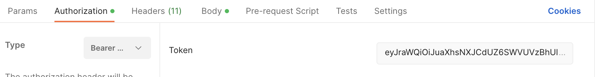
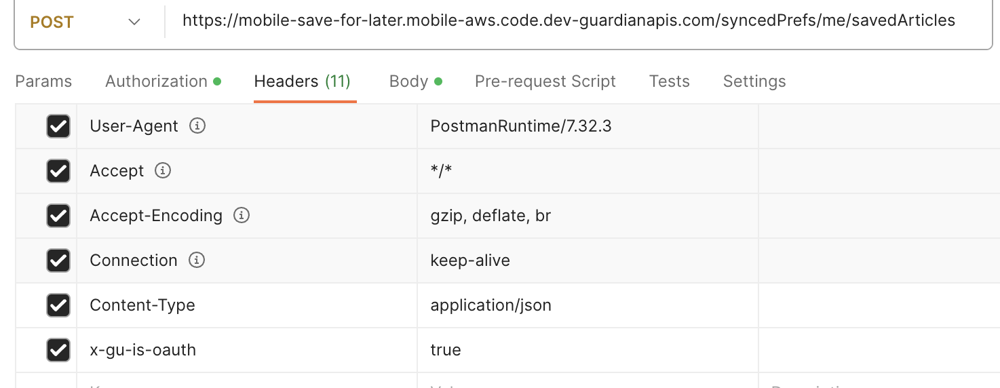
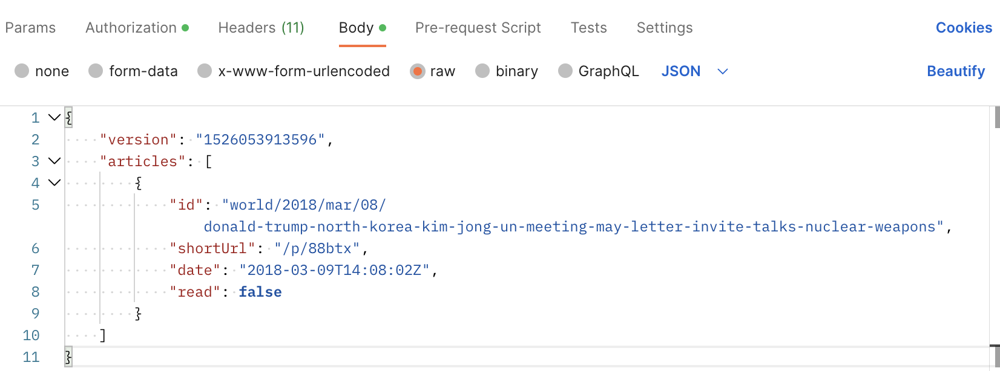
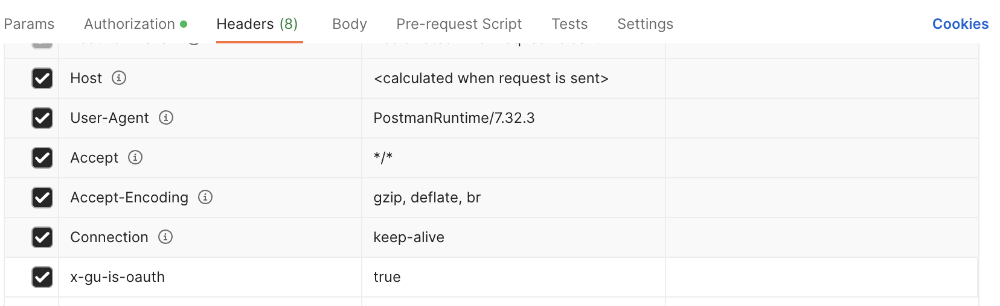

### Setting Up Oauth Flow
1) Download [Postman](https://www.postman.com/downloads/)
2) Set up acquiring an OKTA Auth token following these [instructions](https://github.com/guardian/identity/blob/a19ac17655fd715f15e8d0912b39173c199a8439/docs/postman/README.md). (Add 'guardian.save-for-later.update.self guardian.save-for-later.read.self' to the Scope field in Step 7)

### Testing the POST endpoint

1) Select a POST request to https://mobile-save-for-later.mobile-aws.code.dev-guardianapis.com/syncedPrefs/me/savedArticles
   
2) Under the `Authorization` tab, on the type dropdown select `Oauth 2` and under `token` select the token that you saved
in the oauth flow
   
3) Under the `Headers` tab add `Content-Type: application/json` and `x-gu-is-oauth: true`
   
4) Under the body tab add data in the format:
```agsl
    {
        "version": "1526053913596",
        "articles": [{
            "id": "world/2018/mar/08/donald-trump-north-korea-kim-jong-un-meeting-may-letter-invite-talks-nuclear-weapons",
            "shortUrl": "/p/88btx",
            "date": "2018-03-09T14:08:02Z",
            "read": false
        }]
    }
```




### Testing the GET endpoint
1) Select a GET request to https://mobile-save-for-later.mobile-aws.code.dev-guardianapis.com/syncedPrefs/me
   
2) Under the `Authorization` tab, on the type dropdown select `Oauth 2` and under `token` select the token that you saved
   in the oauth flow
   
3) Under the `Headers` tab add `x-gu-is-oauth: true`
   


## Testing locally

### Pre-requisites
1) Mobile credentials from [Janus](https://janus.gutools.co.uk/login)
2) Follow the authentication flow as outlined at the [top](#setting-up-oauth-flow)

* Go to the drop down menu between the build and play button and select `Edit Configurations`
* Add the following environment variables:
  `App=mobile-save-for-later;IdentityApiHost=https://id.code.dev-guardianapis.com;IdentityOktaAudience=https://profile.code.dev-theguardian.com/;IdentityOktaIssuerUrl=https://profile.code.dev-theguardian.com/oauth2/aus3v9gla95Toj0EE0x7;Stage=CODE;SavedArticleLimit=100`
* Press the green play button
* Follow the same steps as above for testing endpoints in the rest client by changing the urls to:
GET: `http://localhost:8888/syncedPrefs/me`
POST: `http://localhost:8888/syncedPrefs/me/savedArticles`