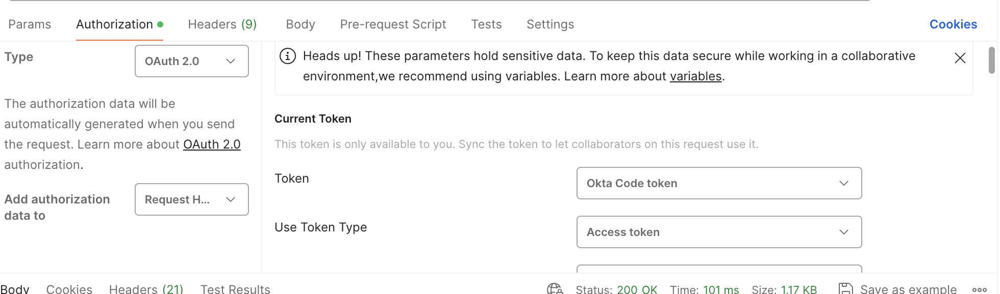

### Pre-requisites
1) Download [Postman](https://www.postman.com/downloads/)
2) Set up acquiring an OKTA Auth token following these [instructions](https://github.com/guardian/identity/blob/a19ac17655fd715f15e8d0912b39173c199a8439/docs/postman/README.md)

### Testing the POST endpoint

1) Select a POST request to https://mobile-save-for-later.mobile-aws.code.dev-guardianapis.com/syncedPrefs/me/savedArticles
   
2) Under the `Authorization` tab, on the type dropdown select `Bearer Token` and paste in the token generated from the Okta auth
   
3) Under the `Headers` tab add `Content-Type: application/json` and `x-gu-is-oauth: true`
   
4) Under the body tab add data in the format:
```agsl
    {
        "version": "1526053913596",
        "articles": [{
            "id": "world/2018/mar/08/donald-trump-north-korea-kim-jong-un-meeting-may-letter-invite-talks-nuclear-weapons",
            "shortUrl": "/p/88btx",
            "date": "2018-03-09T14:08:02Z",
            "read": false
        }]
    }
```


### Testing the GET endpoint
1) Select a GET request to https://mobile-save-for-later.mobile-aws.code.dev-guardianapis.com/syncedPrefs/me/savedArticles
   
2) Under the `Authorization` tab, on the type dropdown select `Bearer Token` and paste in the token generated from the Okta auth
   
3) Under the `Headers` tab add `x-gu-is-oauth: true`
   